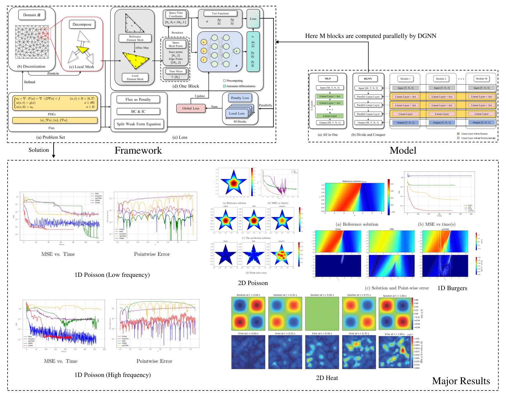
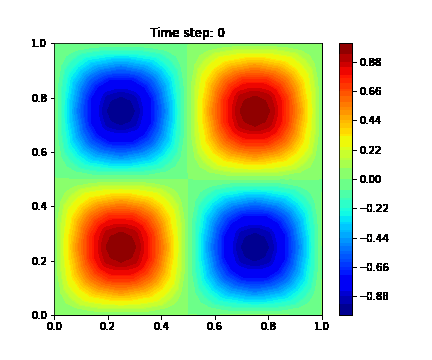

# DGNN
Title: DGNN: A Neural PDE Solver Induced by Discontinuous Galerkin Methods

Paper Link: [https://arxiv.org/abs/2503.10021](https://arxiv.org/abs/2503.10021)

## Abstract
We propose a novel DNN-based and data-free framework, Discontinuous Galerkin-induced Neural Network (DGNN),  for solving PDEs. Our proposed approach is inspired by the Interior Penalty Discontinuous Galerkin Method (IPDGM) to effectively handle complex equations. Within this framework, the trial space is constructed from the piecewise neural network space defined on subdomains, while the test function space comprises piecewise polynomials. Meanwhile, we introduce weak formulations to enforce local conservation, design parallel linear layers aligned with the modular network structure, and implement a numerical flux-based communication mechanism to ensure stable and efficient information exchange between subnetworks. Numerical experiments demonstrate that DGNN achieves superior accuracy, faster convergence, and enhanced training stability across various challenging benchmarks, including stationary and time-dependent PDEs, particularly those involving strong perturbations, discontinuous solutions, and complex geometric domains.

## Framework

## Numerical Experiments
An example: 2D Heat Equation.

